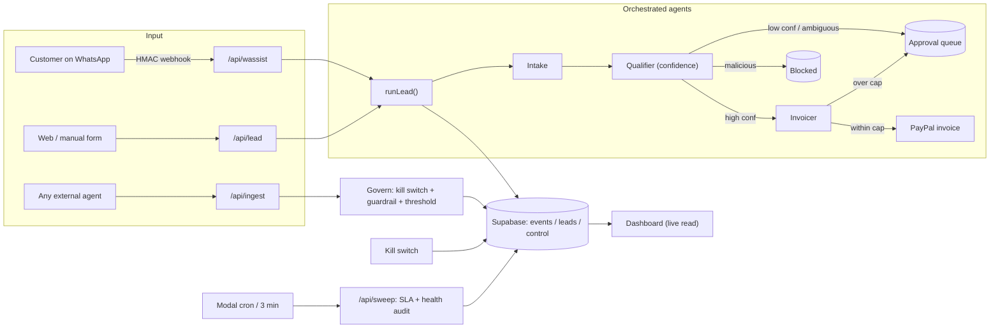
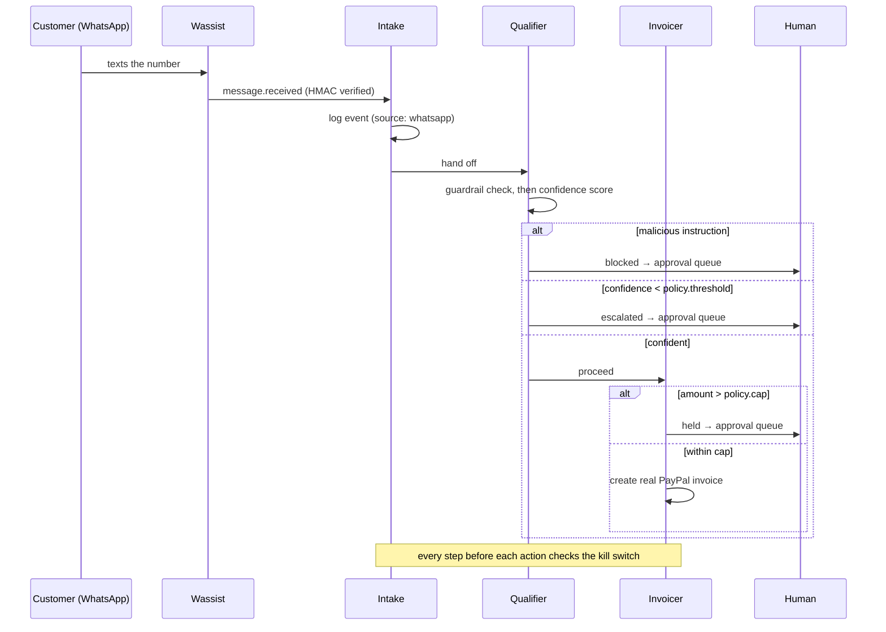

# Leash — Architecture

**Leash is the governance layer and off switch for autonomous agents.** Agents do the
work; Leash makes every action visible, governable, and reversible. The demo workload is
an inbound-lead agency, but the layer is generic — any agent can emit to it.

## System at a glance



## The one design decision

Every agent action is **one append-only row** in `events`. The dashboard is a live view of
that stream. Shallow agents, visible seams, a real audit trail.

```
events { id, created_at, lead_id, agent, action, input, confidence, decision, status, reason }
```

- `agent` — intake | qualifier | invoicer | system | <external>
- `confidence` — 0..1 (qualifier only)
- `decision` — auto_proceed | escalate | blocked | approved | rejected
- `status` — done | awaiting_approval | blocked | killed

`control` is a single row holding the **kill switch and the policy**:
`{ paused, threshold (0..1), cap (£), business }`.

## The lead lifecycle



## Governance mechanisms (the product)

- **Kill switch** — `control.paused`. Every agent reads it *before acting* and refuses if on.
  Enforced in code, not a prompt the agent can ignore. Applies to the unattended runner too.
- **Policy** — `threshold` and `cap` set in onboarding, persisted in `control`, read by the
  orchestrator at decision time. "You set the rules, the agents follow them" — literally.
- **Guardrail** — malicious / out-of-scope instructions are pattern-matched and routed to the
  human queue, never executed.
- **Approval queue** — low-confidence, high-value, and blocked actions wait for a human.
- **Audit trail** — every decision with its reason is one event; incident review is reading, not guessing.
- **SLA sweep** — Modal flags approvals left waiting past the SLA, unattended.
- **Governance as a service** — `POST /api/ingest` lets any external agent inherit all of the above.

## What is real vs. sandbox/heuristic (no hand-waving)

| Piece | State |
|---|---|
| Event store / audit trail | **Real** — Supabase Postgres, persisted |
| WhatsApp intake | **Real** — Wassist webhook, HMAC-SHA256 verified |
| Invoices | **Real PayPal** — sandbox mode (correct: you cannot take real money in a demo) |
| Governance policy | **Real** — threshold + cap actually drive the agents |
| Unattended runtime | **Real** — Modal cron runs an SLA + health sweep on real state |
| Qualifier scoring | **Deterministic scorer** by default; swaps to Claude when `ANTHROPIC_API_KEY` + `USE_LLM_QUALIFIER=1` are set |

## Auth

The dashboard is gated by **Supabase Auth** (email + password). The public landing stays open;
`/dashboard` requires a session. Per-route API authorization and per-tenant row-level security
are the documented next step toward full multi-tenancy.

## Surfaces

- Landing: `/` (public marketing)
- App: `/dashboard` (auth-gated governance console)
- APIs: `/api/lead`, `/api/wassist`, `/api/ingest` (input) · `/api/events`, `/api/control`,
  `/api/approve`, `/api/policy`, `/api/reset` (console) · `/api/sweep` (Modal)

## Deploy

Next.js on Vercel (`tryleash.vercel.app`), Supabase Postgres, Modal for the cron. Secrets in
Vercel env. One-time DB setup: run `supabase/schema.sql`.
